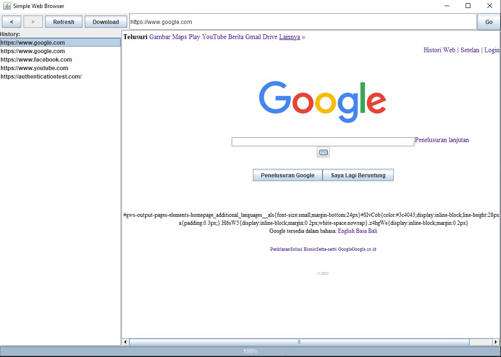
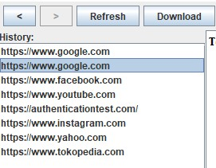
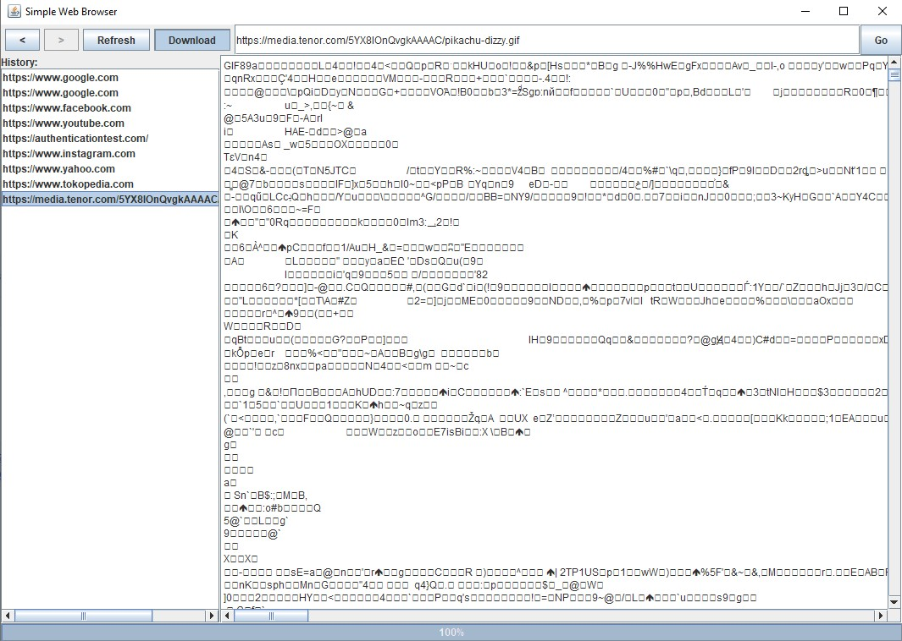
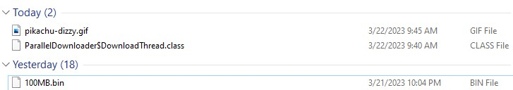
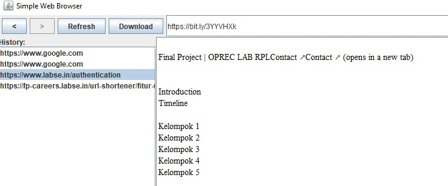
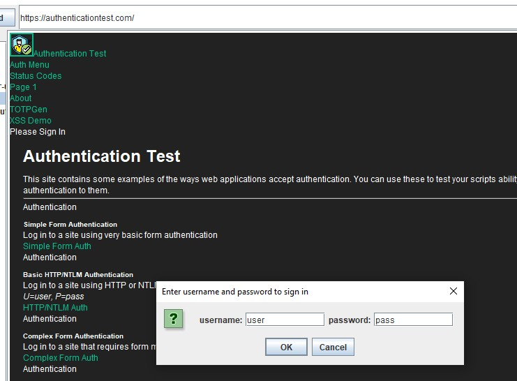
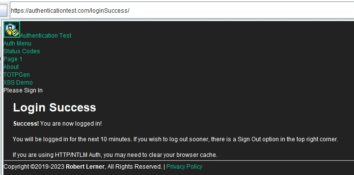

# Simple Web Browser

Develop a simple web browser that can:
- &#x2611; Open a web page given a URl and shows the text  

- &#x2611; Show a list of clickable links  

- &#x2611; Download a file regardless of its size 
- Try open [dizzy.gif](https://media.tenor.com/5YX8IOnQvgkAAAAC/pikachu-dizzy.gif)

- &#x2610; Download a file in parallel 
- &#x2611; Follow redirections 
- Try open [https://bit.ly/3YYVHXk](https://bit.ly/3YYVHXk)

- &#x2611; Show respective HTTP error messages 
- &#x2611; Open a web page that is a protected by HTTP basic authentication 

- &#x2610; Can access a web page that is protected behind a login page 